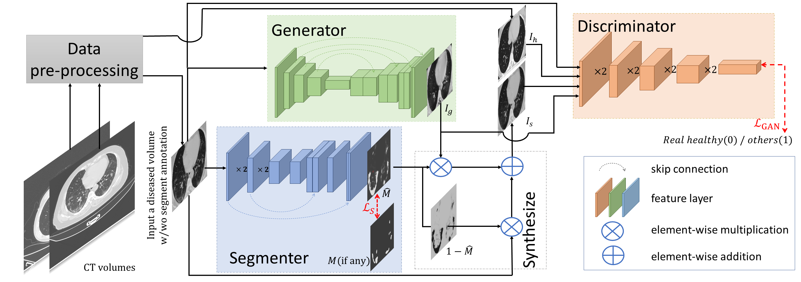
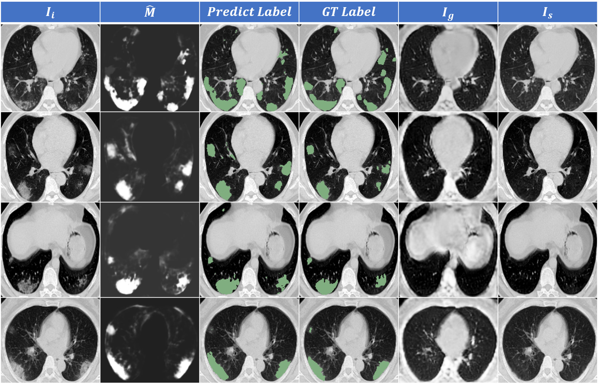

# GASNet
This is a PyTorch implementation of GASNet for lesion segmentation of COVID-19 in a weakly-supervised scenario.

## Architecture

Three modules with optimizable parameters compose the framework of GASNet, the segmenter (S), the generator (G), and the discriminator (D). 
    The segmenter (S) predicts the infected areas given a CT volume. The generator (G) generates
    a new volume. By replacing lesion areas in the original volume by the generated volume,
    a synthesis volume is obtained. 
    The synthetic volumes and the real healthy volumes are input into a discriminator (D) for classification. The parameters of the G and the S are
      optimized to make the synthetic volume look as similar as possible to a real healthy volume, so that the discriminator can not distinguish. 
      Original COVID-19 volume and the generated volume are also fed into the D as auxiliary constraints. 
      Only the S part is needed during the test, 
      which means GASNet has no extra computational 
      burden compared with the standard segmentation network. 

## Prerequisites
- python 3.7
- pytorch 1.2.0
- torchvision 0.4.0
- numpy, skimage, scipy, SimpleITK, and imgaug

## Usage 
### Data-preprocessing 
Your need do some data-preprocessing work before use the data to train GASNet. An open-soure lung segmentation mask is available at <https://github.com/JoHof/lungmask> so you can get the bound box around the lung area. The 3D volume sample of each CT, along with the lung mask and lesion segmentation label (if any),
is cropped along the lung mask. The cropped CT volume is then
resized into 40×160×160, and its value is clipped into [-1250,250]. 


To run the code both in training and testing, three dirs are needed, including ./images to restore CT volumes, ./lung to restore lung segmentation results, and ./lesion to restore lesion labels. Change the root path of the dataset in ./configs/Gan.yaml to your dataset path and modify the splition configuration according to your needs. 

### Training
Simply run 
```
sh train.sh
```
to train GASNet. To add or delete the constraint losses metioned in the paper, you can change the prefix of EXP.ID in the configure file.

### Testing
Simply change the path to your trained model and run 
```
sh test.sh
```
to test the performance of GASNet. 
### Result and visualization
- Dataset-A consists of 20 CT volumes and 10 of them have been transformed to the range of [0, 255]. Considering the original CT values are unavailabel, we divide them into two subsets and test the performances respectively.
 The dataset is availabel at [CovidSeg](https://zenodo.org/record/3757476#.X41Jj-biuiN)
- Dataset-B contains 9 COVID-19 CT volumes. 
The dataset is availabel at [MedSeg](https://medicalsegmentation.com/covid19/)
- Dataset-C and Dataset-D (Volume-level annotation) are from MosMed. which consists of 856 CT volumes
with COVID-19 related findings as well as 254 CT volumes
without such findings. 50 COVID-19 cases have voxel-level
annotations of lesions by experts, which forms Dataset-C. The
rest of the data, consisting of 254 healthy volumes and 806
COVID-19 volumes excluding 50 voxel-level labeled samples,
forms Dataset-D. The diagnosis results of the CT volumes can
be used as volume-level labels directly.
The dataset is availabel at [MosMed](https://mosmed.ai/en/)
- Dataset-E (Volume-level annotation) is a large dataset
with volume-level annotation we collected, in which 1,678
COVID-19 CT volumes come from the Wuhan Union Hospital, whose patients have been diagnosed as COVID-19 positive
by nucleic acid testing, and 1,031 healthy CT volumes come
from the routine physical examination.

We trained GASNet based on Dataset-E and one voxel-level labeled sample from Dataset-A and test the performance on the rest of the three public dataset with lesion annotations. We then replaced the Dataset-E with Dataset-D as our volume-level annotation dataset and finetuned the model. The Dice scores of these two trained models are shown below:
|                 | Dataset-A_sub1 | Dataset-A_sub2 | Dataset-B    | Dataset-C    |
| --------------- | -------------- | -------------- | ------------ | ------------ |
| GASNet          | 76.7±6.1(%)   | 63.2±19.4(%)  | 60.2±23.4(%) | 54.2±22.4(%) |
| GASNet_finetune | -              | -              | 59.7±18.5(%) | 58.9±24.4(%) |

For detailed results of our experiments and comparison between GASNet and other existing methods on COVID-19 lesion segmentation, pleas refer to our paper.



## Contact
Never mind opening issues about the code or data. If you have any further questions about GASNet, please contact me <xzw14@tsinghua.org.cn>

